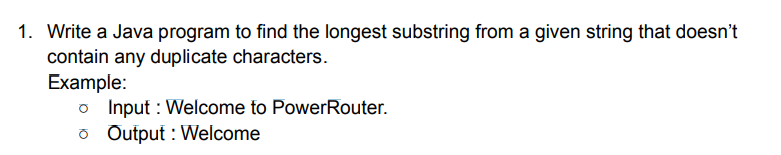

<h2>Update- </h2>

- Input - "Welcome to PowerRouter"
- Output - "lcome to"

 

**Explanation**

- I have used this code to find the longest substring within a given string without any repeated characters.
- I begin by initializing variables to keep track of the current substring (start and end indices), the maximum length
  of the substring without repetition (maxLength), and the starting position of the current substring without
  repetition (currentStart).
- To efficiently keep track of character indices, I use a HashMap (charIndexMap).
- I use a while loop to iteratively go through each character in the input string.
- For each character at the current end position, I check if it is repeated within the current substring. If it is, I
  adjust the starting position (currentStart) to the next index after the repeated character.
- I update the charIndexMap with the current character's index.
- I compare the length of the current substring with the maximum length encountered so far (maxLength). If the current
  substring is longer, I update the starting index (start) and maximum length (maxLength).
- Then I move to the next character in the string by incrementing the end index.
- The final result is the substring without repetition with the maximum length. I determine this by using the start and
  maxLength information.
- Basically I've applied a sliding window approach to efficiently find and update the longest substring without repeated
  characters in the given string.