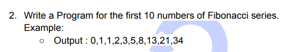

**Explanation**

- I have specified the number of terms (numberOfTerms) I want in the Fibonacci series.
- I initialized the first two terms of the series, previousTerm and currentTerm, to 0 and 1 respectively.
- I printed a message to inform the user that I am generating the modified Fibonacci series up to a certain number of
  terms.
- I have created a list called fibonacciList to store the Fibonacci series.
- I used a for loop to iterate through each term up to the specified number of terms (numberOfTerms).
- At each iteration, I added the previousTerm to the fibonacciList.
- I calculated the next term in the series (nextTerm) by adding the previousTerm and currentTerm.
- I updated previousTerm and currentTerm for the next iteration.
- Finally, I printed the generated Fibonacci series (fibonacciList).
- Basically I've used a loop to generate a modified Fibonacci series up to a specified number of terms, updating the
  terms at each step and storing the series in a list for display