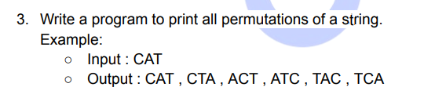

**Explanation**

- I have used a function to swap characters in a given string at specified positions ('i' and 'j'). This function
  converts the string to a character array, performs the swap, and converts it back to a string.
- I have created a function to generate permutations of a given string.
- If I have reached the end of the string, I add the current permutation to the ArrayList.
- Otherwise, I use a loop to iterate through each character in the remaining portion of the string.
- For each character, I fix it at the current position and recursively generate permutations for the remaining
  characters.
- I achieve this by swapping the current character with the character at the current position and then calling the
  function recursively.
- After generating permutations for the current fixed character, I backtrack by swapping the characters back to explore
  other possibilities.
- This backtracking step ensures that I explore all combinations and do not miss any permutation.
- I have used an ArrayList to store all the generated permutations.
- After generating all permutations, I print the contents of the ArrayList.
- Basically the logic involves systematically swapping characters in a recursive manner to explore all possible
  permutations of a
  given string and storing them in an ArrayList for output.