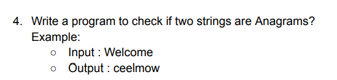

<h2>Update- </h2>

- Input - "Welcome", "ceelmow"
- Output - "Welcome and ceelmow are anagrams."

**Explanation**

- I start with two strings, str1 and str2, that I want to check for being anagrams.
- I convert both strings to lowercase using toLowerCase() to ensure a case-insensitive comparison.
- I check if the lengths of the two strings are equal.
    - If not, I print that the strings are not anagrams because anagrams must have the same length.
- I convert each string into a character array (charArray1 and charArray2).
- I sort both character arrays using Arrays.sort().
- I check if the sorted character arrays are equal using Arrays.equals().
    - If they are equal, the strings are anagrams; otherwise, they are not.
- I print the result of the anagram check based on the comparison result.
- If the lengths of the two strings are not equal, I print that they are not anagrams.
- Basically the logic involves converting strings to lowercase, checking their lengths, sorting their characters, and
  comparing the sorted characters to determine if the strings are anagrams or not.