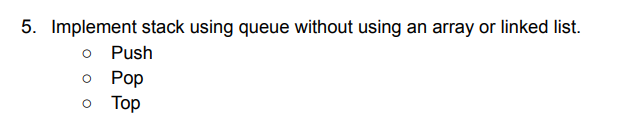

**Explanation**

- I have a queue (q) to implement a stack.
- When I push an element onto the stack:
    - I add the new element to the end of the queue using q.offer(x).
    - I rearrange the elements in the queue to simulate the stack behavior. I iterate through the elements and move them
      to the end of the queue.
- When I pop an element from the stack:
    - I remove and return the front element of the queue using q.poll().
- When I want to get the top element of the stack without removing it:
    - I find the front element of the queue using q.peek().
- Basically the logic involves using a queue to simulate a stack. The push() operation adds elements to the end of the
  queue and rearranges them to simulate a stack. The pop() operation removes elements from the front of the queue, and
  the top() operation retrieves the front element without removing it.