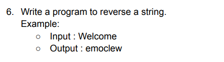

**Explanation**

- I start with an original string, str1, which is initially set to "Welcome".
- I print the original string using System.out.println("Original string: " + str1).
- I calculate the length of the string using int n = str1.length().
- I create an empty string, reverseString, to store the reversed version.
- I use a for loop to iterate through each character of the original string.
- Inside the loop, I fetch each character, ch, from the original string.
- I add each character in front of the reverseString to build the reversed string.
- Finally, I print the reversed string using System.out.println("Reversed string: " + reverseString).
- Basically the code takes a string, iterates through its characters, and constructs a reversed string by adding each
  character in front of the new string.